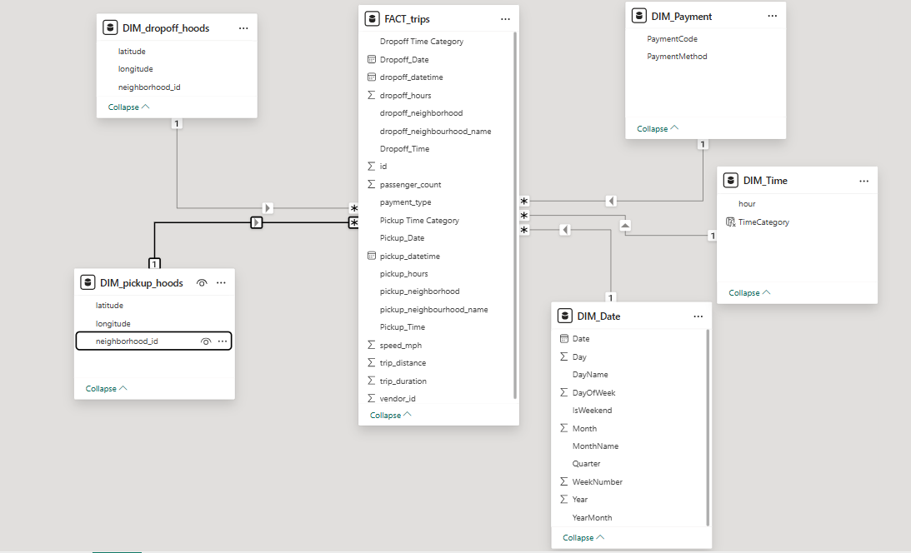

# 🚕 NYC Taxi BI Analysis: Data-Driven Urban Mobility

[](https://powerbi.microsoft.com/)
[](https://www.kaggle.com/datasets/surekharamireddy/new-york-city-taxi-rides)
[](https://opensource.org/licenses/MIT)

> **Course:** DSA3050A - Business Intelligence & Data Visualization  
> **Project:** Group A - New York City Taxi Rides Analysis

---

## Introduction

Welcome to the **NYC Taxi BI Analysis** project. New York City is one of the most complex urban environments in the world, and its taxi system is a vital artery of its transportation network. This project leverages the power of **Business Intelligence** to transform over 50,000 rows of raw taxi trip data into actionable insights.

By applying rigorous data cleaning, advanced star-schema modeling, and sophisticated DAX calculations, we aim to uncover the "pulse" of the city—identifying when, where, and how New Yorkers move.

---

## Table of Contents

- [Project Roadmap](#-project-roadmap)
- [Problem Statement](#-problem-statement)
- [Business Questions](#-business-questions)
- [Data Architecture](#-data-architecture)
- [Repository Structure](#-repository-structure)
- [Tech Stack & Methodology](#-tech-stack--methodology)
- [The Team](#-the-team)
- [Quick Links](#-quick-links)

---

## Project Roadmap

What lies ahead in this repository? We have structured our BI journey into five distinct phases:

1.  **Phase 1: Exploration & Proposal** 
    *   Identifying dataset legitimacy and defining core business problems.
2.  **Phase 2: Data Engineering (ETL)** 
    *   Transforming raw CSVs using Power Query (handling nulls, outliers, and data types).
3.  **Phase 3: Data Modeling** 
    *   Designing a robust Star Schema for optimal performance and scalability.
4.  **Phase 4: DAX Development** 
    *   Crafting complex measures for Year-over-Year (YoY) growth, peak hour analysis, and efficiency metrics.
5.  **Phase 5: Visualization & Insights** 
    *   Building an interactive Power BI dashboard to communicate findings effectively.

---

## Problem Statement

NYC's taxi operations face significant challenges in **balancing supply and demand**. Inefficiencies in fleet utilization lead to long passenger wait times in some areas while drivers remain idle in others. 

**Our Goal:** To provide data-driven recommendations that improve taxi availability, reduce wait times, and maximize driver revenue through optimized route and timing decisions.

---

## Business Questions

We set out to answer seven critical questions that drive operational excellence:

1.  **Peak Demand:** What are the peak hours and days across different neighborhoods?
2.  **Revenue Hubs:** Which neighborhoods generate the highest trip volumes and revenue?
3.  **Fare Correlation:** How does trip distance correlate with fare amount and payment type?
4.  **Efficiency:** What is the average trip duration, and how does it vary by time of day?
5.  **Payment Trends:** Which payment methods are most common, and do they vary by location?
6.  **Passenger Dynamics:** How many passengers typically ride together?
7.  **Commuter Patterns:** What is the relationship between pickup and dropoff neighborhoods?

---

## Data Architecture

To ensure high performance, we implemented a **Star Schema** model. This structure separates our quantitative data (Facts) from our descriptive data (Dimensions).

### The Star Schema


*   **Fact Table:** `FactTrips` (Trip ID, Date, Distance, Duration, Fare, etc.)
*   **Dimensions:**
    *   `DimDate`: Comprehensive calendar hierarchy.
    *   `DimTime`: Hour-level analysis and Peak/Off-Peak categorization.
    *   `DimPickupNeighborhood`: Geographical lookup for origins.
    *   `DimDropoffNeighborhood`: Geographical lookup for destinations.
    *   `DimPayment`: Decoding payment codes (Credit Card, Cash, etc.).

---

## Repository Structure

```directory
.
├── data/                    # Source CSV files from Kaggle
├── documentation/           # Detailed ETL process, DAX logic, and screenshots
│   └── README.md            # Deep-dive into transformations
├── pbix/                    # Final Power BI Desktop file
│   └── README.md            # Dashboard usage guide
├── presentation/            # Slides and presentation materials
│   └── README.md            # Presentation structure & guide
└── README.md                # Main project entry point (you are here)
```

---

## Tech Stack & Methodology

-   **Tool:** Microsoft Power BI
-   **ETL:** Power Query M-Language
-   **Logic:** DAX (Data Analysis Expressions)
-   **Version Control:** Git & GitHub

### Key DAX Metrics Developed:
*   `Total Trips`: Count of all valid taxi rides.
*   `Trips YoY Growth`: Comparing performance against the previous year.
*   `Peak Hour Trips`: Filtering demand for high-traffic windows.
*   `Average Speed (MPH)`: Derived from distance and duration to identify congestion.

---

## The Team

We are a group of dedicated students from **DSA3050A**, passionate about data and urban mobility.

| Name | Student ID (Last 3) |
| :--- | :--- |
| **Tanveer Omar** | 762 |
| **Mohamed Mohamed** | 006 |
| **Mitchel Muthaura** | 413 |
| **Calvin Gacheru** | 035 |
| **Claire** | 042 |
| **Lavender Nchagwa** | 617 |

---

## 🔗 Quick Links

-   **Kaggle Dataset:** [NYC Taxi Rides](https://www.kaggle.com/datasets/surekharamireddy/new-york-city-taxi-rides)
-   **Presentation Slides:** [Google Slides](https://docs.google.com/presentation/d/1Y9mi9wlte_jByuIBo5VOkpEVG015vHF-8lsqFSNJjXo/edit?usp=sharing)
-   **Detailed Documentation:** [View Transformation Process](./documentation/README.md)

---

