# 🚗 New YorK City Taxi Rides

### Power BI Business Intelligence Project

**Course:** DSA3050A – Business Intelligence & Data Visualization
**Students:** 
- Tanveer 762
- Mohamed 006
- Mitchel 413
- Calvin 035
- Claire 470
- Lavender 

# Week 6 - Proposal

# Problem Statement

New York City's taxi operations face challenges in optimizing fleet utilization, 
understanding passenger demand patterns, and maximizing revenue across different 
neighborhoods and time periods. This project analyzes NYC taxi trip data to 
identify operational inefficiencies, peak demand periods, and neighborhood-level 
performance metrics. The goal is to provide data-driven recommendations for 
improving taxi availability, reducing passenger wait times, and increasing driver 
revenue through better route and timing decisions.

## Proof of Dataset legitimacy
-Taxi rides dataset url(Taxi)

- Taxi rides website evidence
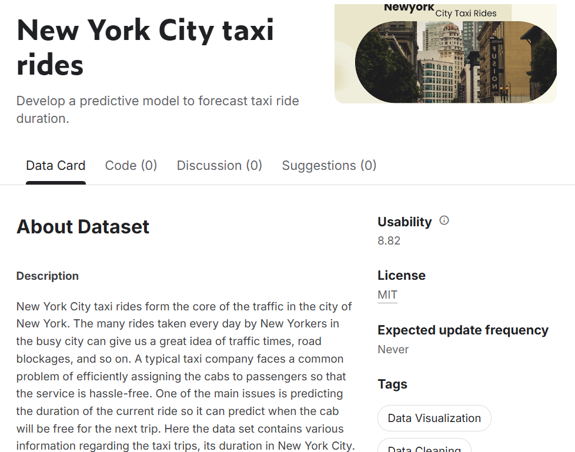

## Business Questions

1. What are the peak hours and days for taxi demand across different neighborhoods?
2. Which neighborhoods generate the highest trip volumes and revenue?
3. How does trip distance correlate with fare amount and payment type?
4. What is the average trip duration and how does it vary by time of day?
5. Which payment methods are most common and how do they vary by neighborhood?
6. How many passengers typically ride together and does this affect trip distance?
7. What is the relationship between pickup and dropoff neighborhoods (commuter patterns)?

## Entity Relationship Diagram Draft

### Source Tables

**trips_1.csv** (Fact Table - 50,000+ rows)
- id (Primary Key)
- vendor_id
- pickup_datetime
- dropoff_datetime
- passenger_count
- trip_distance
- pickup_longitude
- pickup_latitude
- dropoff_longitude
- dropoff_latitude
- payment_type (1-6 code)
- trip_duration
- pickup_neighborhood (FK to pickup_neighborhoods)
- dropoff_neighborhood (FK to dropoff_neighborhoods)

**pickup_neighborhoods.csv** (Dimension)
- neighborhood_id (Primary Key)
- neighborhood_name

**dropoff_neighborhoods.csv** (Dimension)
- neighborhood_id (Primary Key)
- neighborhood_name

### Planned Star Schema

**Fact Table:**
- FactTrips (id, date_key, vendor_id, passenger_count, trip_distance, 
  payment_type, trip_duration, pickup_neighborhood_key, dropoff_neighborhood_key)

**Dimension Tables:**
- DimDate (date_key, date, year, month, day, day_of_week, hour, quarter)
- DimPickupNeighborhood (neighborhood_key, neighborhood_id, neighborhood_name)
- DimDropoffNeighborhood (neighborhood_key, neighborhood_id, neighborhood_name)
- DimPayment (payment_key, payment_code, payment_description)
- DimVendor (vendor_key, vendor_id, vendor_name)

## Data Source

**Dataset:** New York City taxi rides
**Source:** Kaggle (https://www.kaggle.com/datasets/surekharamireddy/new-york-city-taxi-rides)
**Files:**
- trips_1.csv (Main trip records)
- pickup_neighborhoods.csv (Pickup location lookup)
- dropoff_neighborhoods.csv (Dropoff location lookup)

### Data Citation
Ramireddy, S. (2023). New York City taxi rides [Data set]. Kaggle. 
https://www.kaggle.com/datasets/surekharamireddy/new-york-city-taxi-rides

# Week 8 - Power query Transformations

#### loading data into POWER BI
loading all 3 datasets to powerBI for Transformation
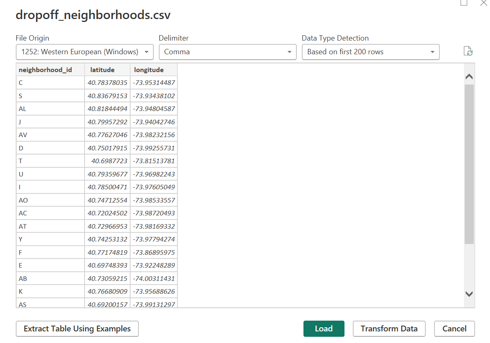

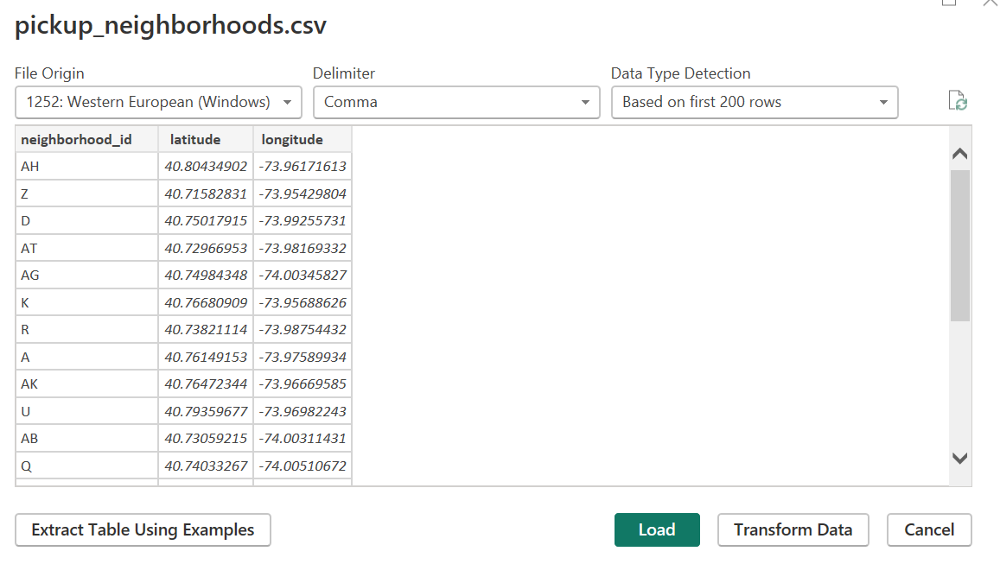

#### Renaming the Queries
- trips_1 → FACT_trips
- pickup_neighborhoods → DIM_Pickup_hood
- dropoff_neighborhoods → DIM_Dropoff_hood

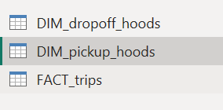

## Transformations:

### Promoting headers
**On FACT_trips table**

**Original**

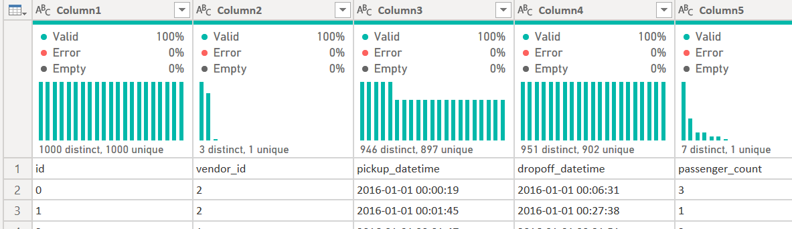

**Transformation**

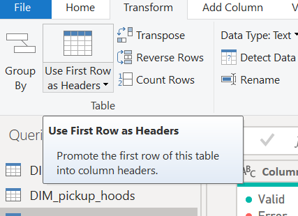

**Final**

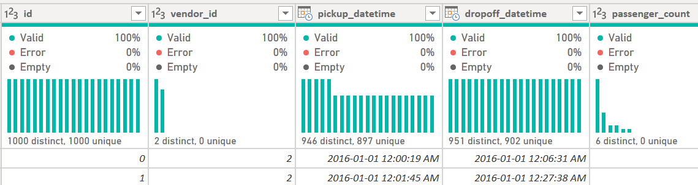

### Removing Unnecessary Columns

**On FACT_trips table**

We decided to get rid of pickup longitude and lattitude as well as drop off longitude and lattitude as they exist in the Dimension tables and are redundant for the FACT table.

**Original**

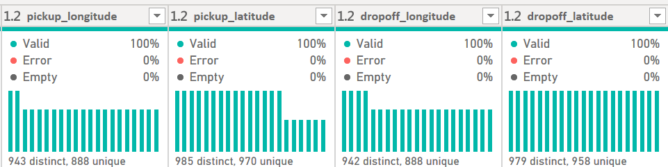

**Transformation**

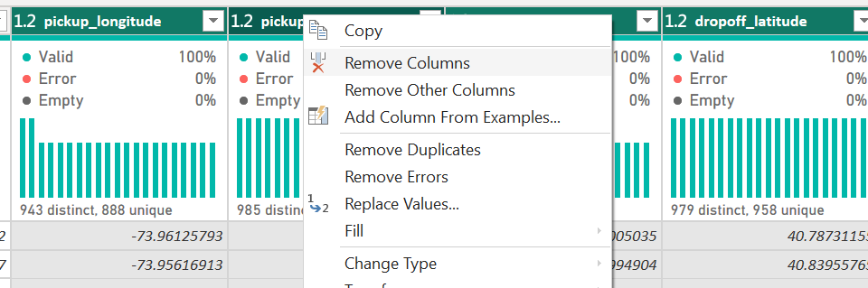

**Final**

### Fixing Data Types

**On FACT_trips table**

#### **Pickup Datetime**

**Original**

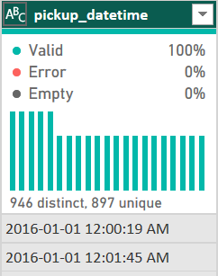

**Transformation**

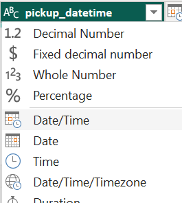

**Final**

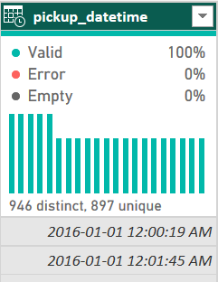

#### **Dropoff Datetime**

**Original**

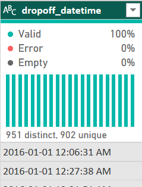

**Transformation**

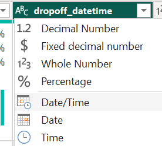

**Final**

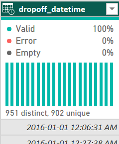

#### **Passenger Count**
This needs to be whole numbers

**Original**

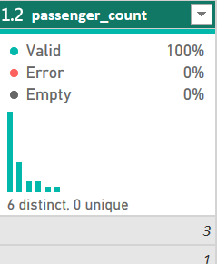

**Transformation**

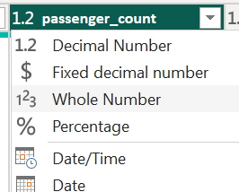

**Final**

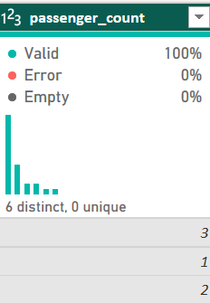

#### **Splitting datetime columns**

##### **Date Only Columns**

**Original**

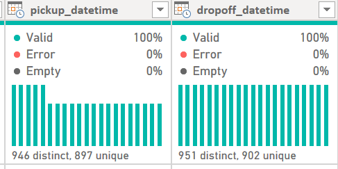

**Transformation**

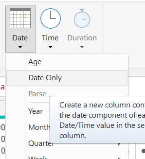

**Final**

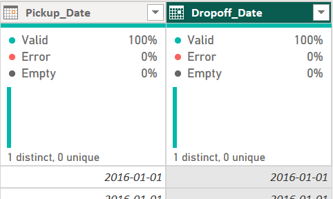

##### **Time Only Columns**

**Original**

**Transformation**

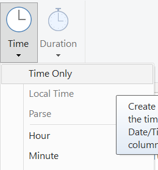

**Final**

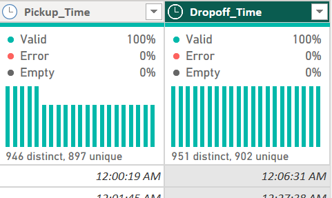

#### **Creating Conditional Column (Peak Hours)**
Creating a new column called pickup and dropoff time Time Category labelling peak hours and off peak hours

**Original**

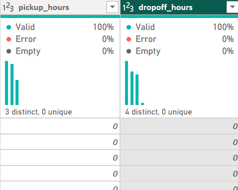

**Transformation**

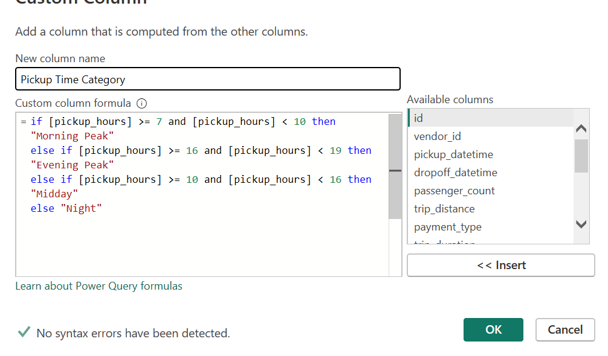
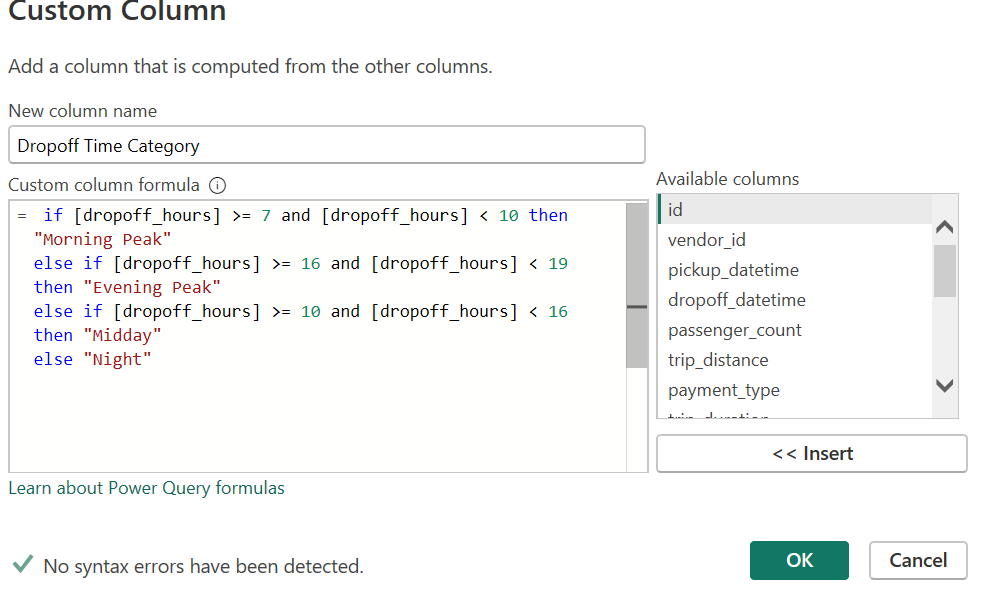

**Final**

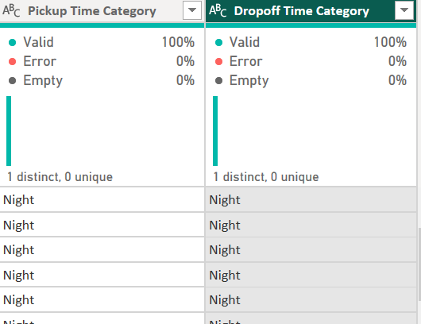

#### **Handling Null Values**
**DIM_Dropoff_hoods Table**

**Original**
We can see from the image that we indeed have nulls that need to be handled

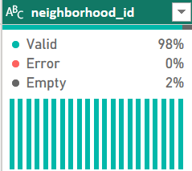

**Transformation**

REMOVING EMPTY

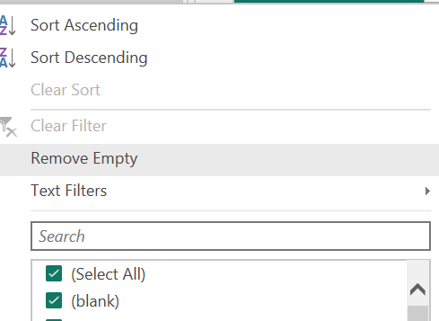

**Final**
No more NULLS

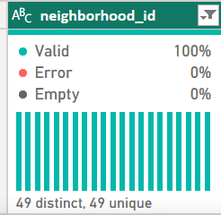

#### **Filtering OUTLIERS**
We can see from the FACT Table in the trip_distance column that there are some distances marked as 0 distance. This is an outlier and will affect visualizations as well as confound our observations.

**Original**

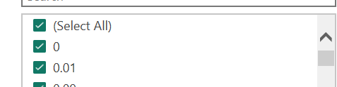

**Transformation**

We decided to filter for numbers greater than zero

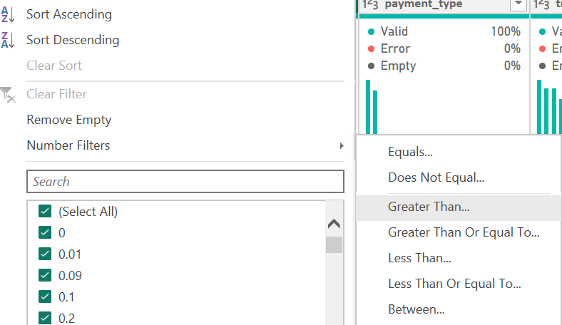

**Final**

We can now see that there is no zero value

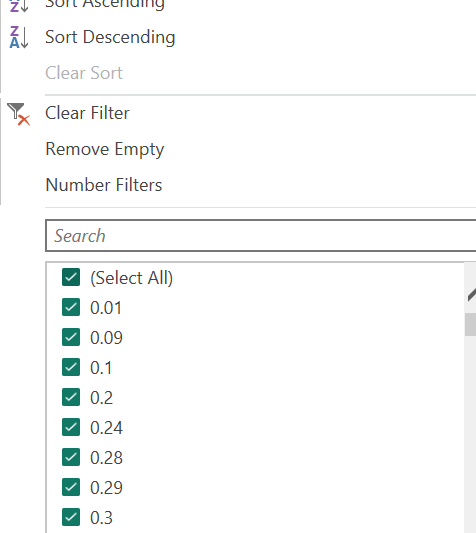

#### **TEXT**
**Original**

**Transformation**

**Final**

#### **TEXT**
**Original**

**Transformation**

**Final**

#### **TEXT**
**Original**

**Transformation**

**Final**

#### **TEXT**
**Original**

**Transformation**

**Final**

#### **TEXT**
**Original**

**Transformation**

**Final**

#### **TEXT**
**Original**

**Transformation**

**Final**

#### **TEXT**
**Original**

**Transformation**

**Final**

#### **TEXT**
**Original**

**Transformation**

**Final**

#### **TEXT**
**Original**

**Transformation**

**Final**

#### **TEXT**
**Original**

**Transformation**

**Final**