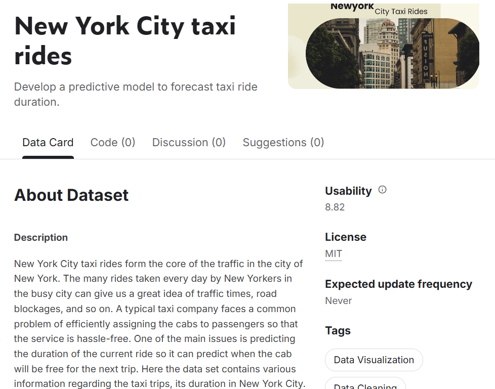
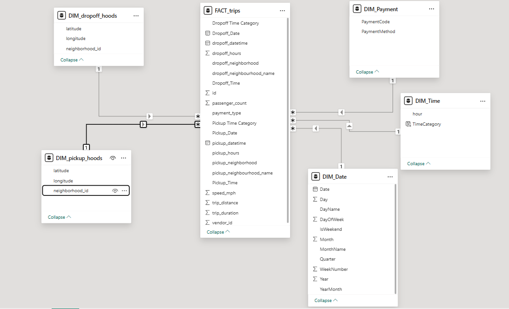
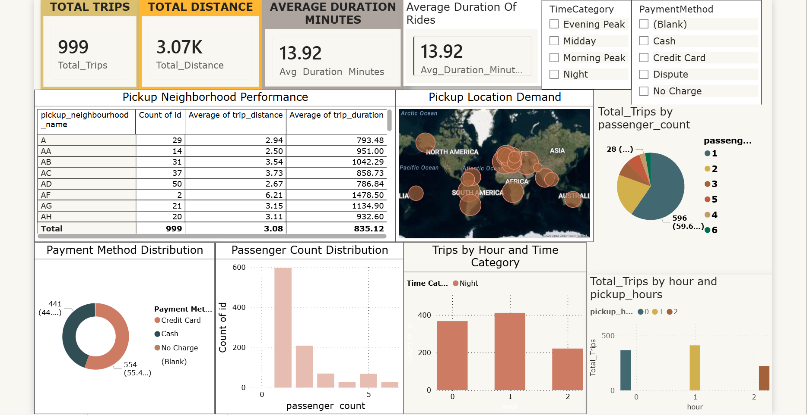

# NYC Taxi BI Analysis 

**Data-Driven Urban Mobility**  

*DSA3050A - Business Intelligence & Data Visualization* 

**Team:** 
Tanveer Omar
Mohamed Mohamed
Mitchel Muthaura
Calvin Gacheru
Claire Mwarari
Lavender Nchagwa

---

# Problem Statement  

**1. The Strategic Gap**
New York City’s taxi ecosystem suffers from a misalignment between dynamic passenger demand and active vehicle supply.

**The Result:** High idle times for drivers in quiet zones and excessive wait times for passengers in high-traffic neighborhoods.

---

**2. Key Operational Variables**
To solve this, we must analyze and synchronize three critical factors:

 **Location:** Geographic hotspots for pickups vs. drop-offs.

 **Timing:** Hourly and seasonal fluctuations in ride requests.

 **Trip Behavior:** Patterns in duration, distance, and payment types that dictate profitability.

---

# Data Collection  

**Source:**
- Taxi rides website evidence

---

**Executive Summary of the data**

**Executive Summary: NYC Taxi Trip Duration Analysis**

* **Dataset Scope:** Analysis of 50,000+ trip records from three distinct taxi vendors to identify urban traffic patterns and mobility trends.
* **Temporal & Spatial Variables:** Integration of precise pickup/drop-off timestamps and geographic coordinates (latitude/longitude) mapped to specific NYC neighborhoods.
* **Operational Metrics:** Tracking of passenger counts, trip distances (miles), and payment types (Credit, Cash, etc.) to evaluate service usage.
* **Primary Objective:** Modeling **trip_duration** as the target variable to optimize vehicle dispatching and predict fleet availability for subsequent trips.
* **Strategic Goal:** Leveraging dependency analysis between trip variables to minimize idle time and improve taxi assignment efficiency across high-demand zones.

---

# Data Architecture and Star schema 
**Why Star Schema?**
- Enables fast, scalable analytics
- Simplifies complex queries
- Supports flexible slicing/dicing for BI

**Visual: Star Schema**

---

---
# Data Cleaning and Transformation
The dataset underwent rigorous cleaning and transformation to ensure high-quality, actionable insights:

- **Promoted Headers**: Set the first row as headers for accurate column identification.
- **Renamed Queries**: Standardized naming conventions (e.g., changing trips_1 to FACT_trips).
- **Removed Columns**: Deleted redundant latitude and longitude columns from the Fact table, as they exist in Dimension tables.
- **Fixed Data Types**: Corrected types for numerical and datetime fields.

---

- **Split Columns**: Separated pickup and drop-off datetime columns into distinct "Date Only" and "Time Only" columns.
- **Handled Nulls**: Filtered out empty values from neighborhood ID columns.
- **Filtered Outliers**: Excluded trips with a distance of 0 to prevent skewed visualizations.
- **Removed Duplicates**: Deleted duplicate records based on the unique id column.
- **Merged Queries**: Joined the Fact table with Dimension tables to pull in neighborhood names.

---

- **Replaced Values**: Decoded payment IDs into text (e.g., 1 = "credit card", 2 = "cash", 4 = "disputed").
- **Custom Speed Column**: Created speed_mph formula: = [trip_distance] / [trip_duration]/3600.
- **Conditional Time Columns**: Categorized times into text labels ("Morning Peak", "Midday", "Evening Peak", "Night")

---

## Dimensional Modeling & Optimizations
- **Star Schema Implementation**: Structured the data with one central Fact table (FACT_trips) surrounded by descriptive Dimension tables.
- **One-to-Many Relationships**: Established single-direction, one-to-many relationships connecting Dimension tables (Date, Time, Payment, Pickups, Dropoffs) to the Fact table.
- **Data Reduction**: Optimized model size and performance by dropping duplicate rows and redundant geographical coordinates early in the transformation process.

---

## Analytical DAX Measures & Tables

- **DIM_Date Table**: Created using CALENDAR and ADDCOLUMNS to extract Year, Month, Day, Weekday, Quarter, etc.
- **DIM_Payment Table**: Hardcoded using DATATABLE to map codes (1-4) to strings ("Credit Card", "Cash", etc.).
- **Total Trips**: Total_Trips = COUNTROWS(FACT_trips).
- **Total Distance**: Total_Distance = SUM(FACT_trips[trip_distance]).
- **Average Passengers**: Average_Passengers = AVERAGE(FACT_trips[passenger_count]).
- **Average Duration (Mins)**: Avg_Duration_Minutes = AVERAGE(FACT_trips[trip_duration]) / 60.
- **Trips YTD**: Trips_YTD = TOTALYTD([Total_Trips], DIM_Date[Date]).

---

- **Trips MTD**: Trips_MTD = TOTALMTD([Total_Trips], DIM_Date[Date]).
- **Credit Card %**: Credit Card % = DIVIDE(CALCULATE([Total_Trips], FACT_trips[payment_type] = 1), [Total_Trips], 0).
- **Cash %**: Cash % = DIVIDE(CALCULATE([Total_Trips], FACT_trips[payment_type] = 2), [Total_Trips], 0).
- **Peak Hour Trips**: Peak Hour Trips = CALCULATE([Total_Trips], DIM_Time[TimeCategory] = "Peak").
- **Trips YoY Growth**: Calculates current year trips minus previous year trips (using SAMEPERIODLASTYEAR), divided by previous year trips.
- **Trips QoQ Change**: Compares current quarter trips against previous quarter trips using PREVIOUSQUARTER.
- **Speed Category**: Uses SWITCH to classify average speed: > 30 as "Fast", > 15 as "Normal", and else "Slow".

---

---
  #  Strategic Business Questions

 -  **Wait Times in High-Value Zones:** Which high-value pickup zones (e.g., AH or Z) see the longest wait times, and what is the estimated revenue loss from passenger abandonment?

- **"Deadhead" Mileage Impact:** What is the current ratio of "empty miles" for drop-offs in outer neighborhoods, and how does this erode the fleet’s net margin?

- **Route Efficiency Bottlenecks:**  On which corridors does trip duration disproportionately exceed distance, and are these trips currently operating at a loss?

- **Vehicle Capacity Utilization:** Given the frequency of single-passenger rides, what is the untapped revenue potential of maximizing the "per-seat" value of the fleet?

- **Transaction Friction:** To what extent does payment type (cash vs. credit card) correlate with idling time between trips?

---

- **Vendor Performance Benchmarking:**   What specific operational protocols allow one vendor to consistently outperform the other in efficiency for identical distances?

- **Supply-Demand Alignment:**   How is over-supply during identified low-demand windows impacting individual driver earnings and long-term retention.

---
# Strategic Insights & Recommendations
- **Demand & Supply Synchronization:** Utilize predictive rebalancing and shift synchronization to align driver availability with historical peaks, reducing passenger abandonment and driver churn.

- **Asset & Margin Optimization:** Minimize unprofitable "deadhead" mileage and underutilized vehicle capacity through dynamic return-trip incentives and the introduction of shared-ride tiers.

- **Operational Velocity:** Increase the "trips-per-hour" metric by incentivizing digital payments to reduce transaction friction and standardizing high-performing vendor dispatch algorithms fleet-wide.

- **Revenue Protection:** Mitigate the impact of traffic bottlenecks on daily turnover by implementing congestion surcharges or strategic drop-off points near major transit hubs.

--- 
# Conclusion

This project used business intelligence and data modeling to address inefficiencies in New York City’s taxi system. By transforming over 50,000 trip records into actionable insights, we identified demand patterns, key revenue areas, and operational challenges. The findings informed strategies to optimize fleet allocation, reduce wait times, and increase driver revenue. An interactive Power BI dashboard supports real-time, data-driven decision-making, successfully achieving the goal of smarter urban mobility.

---
# Refferences

**Dataset**
- NYC Taxi Trip Duration Dataset: https://www.kaggle.com/datasets/competitions/nyc-taxi-trip-duration/data

**Power BI Documentation**

